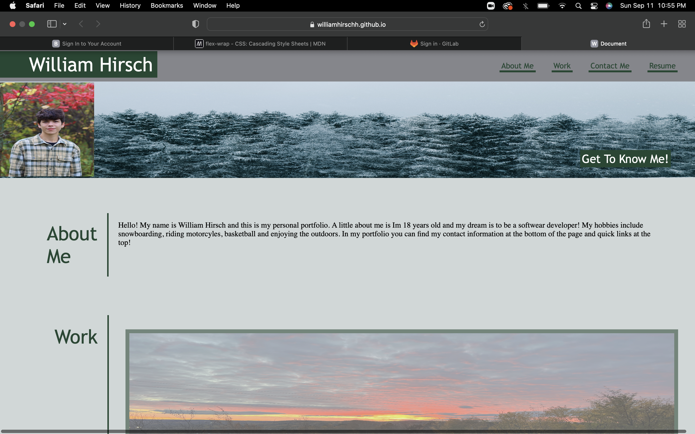
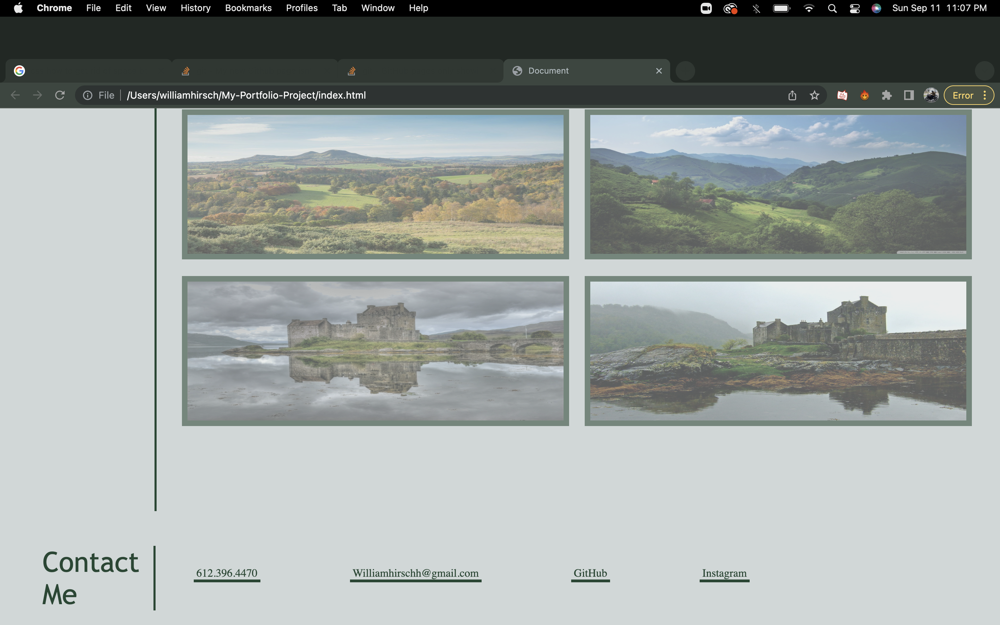

#Description
 My portfolio project was created to share more about me and future projects that I will build, along with making this it provided practice on creating a webpage. In this portfolio there is links to contact me and social media platforms im on, further on it will include a list a projects that I will make.

##Usage
The use of my portfolio is to see all my latest projects and information about me and my hobbies. It also was built to serve as practice for creating a webpage and my skills with HTML and CSS.

#Screenshots

#License 
MIT License

#Features
-Quick acess links.
-Links to projects (Work in progress)
-Contact Information.
-Bio about myself.

#Links
Git hub repo https://github.com/WilliamHirschh

My portfolio https://williamhirschh.github.io/My-Portfolio-Project/